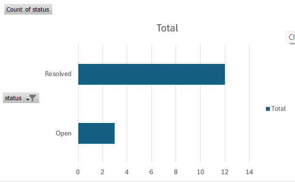
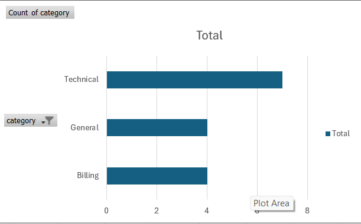
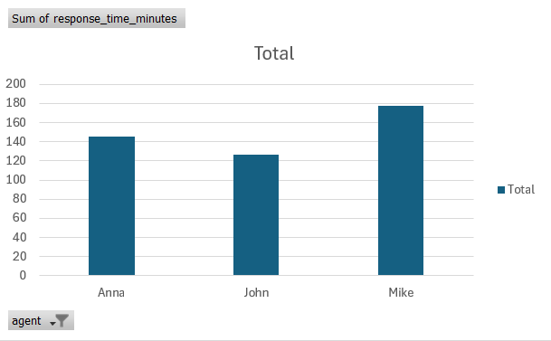
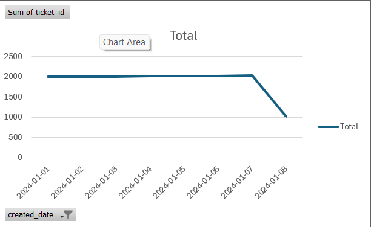

# Customer Support Dashboard

## Project Overview
This project is a beginner-friendly customer support analytics dashboard designed to show how support data can be cleaned, analyzed, and turned into business insights.

The dashboard focuses on key customer support metrics such as:
- total ticket volume
- ticket status
- average resolution time
- issue categories
- priority trends
- busiest support days

## Purpose
The goal of this project is to demonstrate practical skills in:
- SQL
- data analysis
- customer support reporting
- dashboard thinking
- business insight writing

## Tools Used
- SQL
- CSV data
- GitHub
- optional: Excel, Power BI, or Tableau for visualization

## Questions this project answers
- How many tickets were created?
- Which issue categories were most common?
- Which priorities appeared most often?
- How long did tickets take to resolve?
- Which days had the highest support volume?
- What trends could help improve support operations?

## Files in this Project
- `support_data.csv` = sample support ticket data
- `support_dashboard.sql` = SQL analysis queries
- `insights.md` = summary of findings
- `screenshots/` = dashboard or chart images

## Dashboard Preview

### Tickets by Status

### Tickets by Category

### Response Time by Agent

### Daily Ticket Volume

## Data Cleaning
- Handled missing values in the `status` column
- Excluded incomplete records from satisfaction analysis
- Ensured only resolved tickets were used for resolution metrics

## Author
Christine Bilinski
